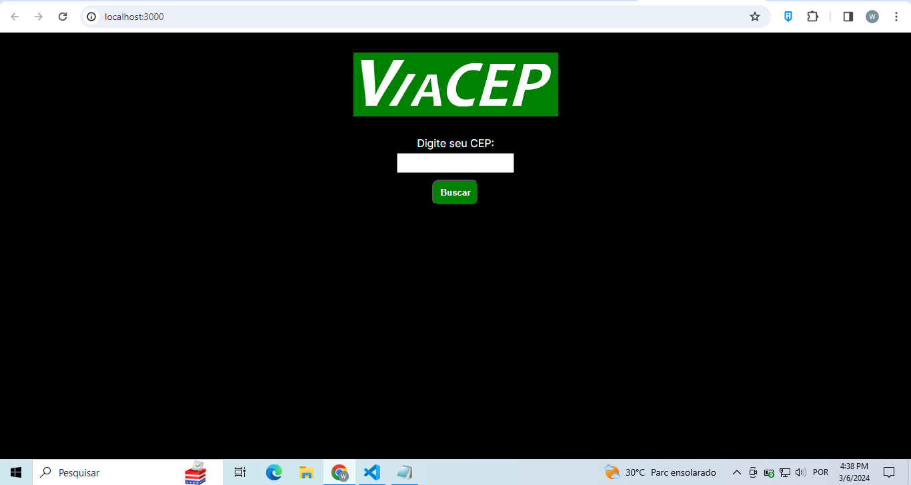
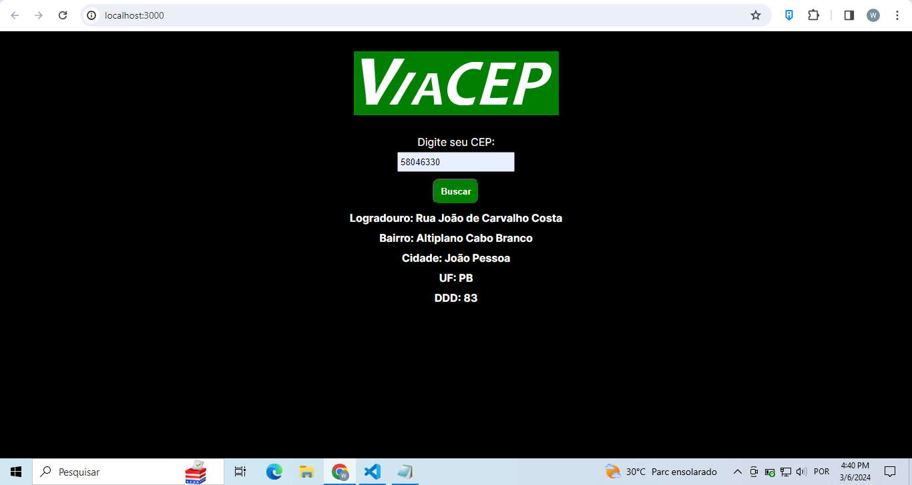

## Olá pessoal, aqui é o segundo desafio da Fábrica de Software.

- Conceitos abordados sobre React, JavaScript e consumo de API;
- Uso do React para componentização e criação de hoock para consumo de dados da API.
- Uso da API https://viacep.com.br/. 
- Validações de Erros.

- O projeto se resume a uma busca de CEP, inserido pelo usuário, resultando nos dados de endereço do CEP inserido.

- Segue imagem do formulário antes da busca:

- Segue imagem após uma busca feita pelo usuário:
